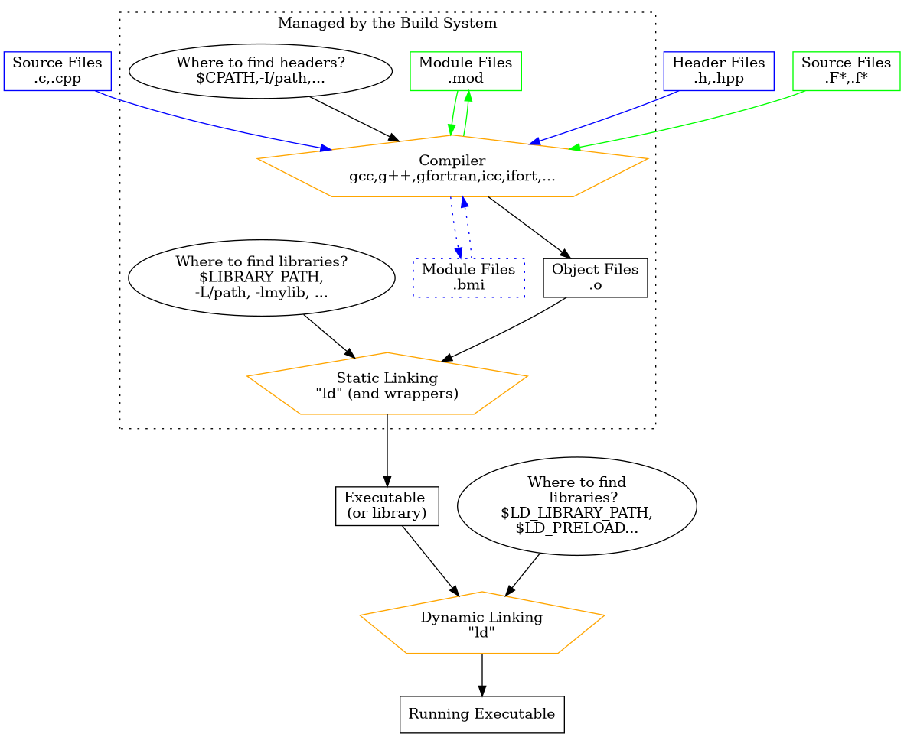

## What is CMake?
Computer program written in languages such as C, C++ and Fortran
need to be compiled using an appropriate compiler in order to
generate an executable.  
Building software can be a very complicated process that requires identifying
the dependencies in the source code and link them accordingly. If the software is
actively developed, these can also change over time.  
For medium to large projects, taking care of such dependencies is a tedious task
that is better performed automatically by a tool, usually called *build system*
(or, more precisely in some cases, *build system generator*).  
[Microsoft Visual Studio own `MSBuild`](https://docs.microsoft.com/en-us/cpp/build/creating-and-managing-visual-cpp-projects?view=vs-2019) on Windows and [the `autotools` suite](https://www.gnu.org/software/automake/manual/)
on Unix are two such tools that are commonly used to build software.
CMake has the advantage to be cross-platform and modern, and it is supported by 
many IDEs 
(integrated development environment) such as Microsoft Visual Studio, Eclipse,
NetBeans, QtCreator, Atom, Code Blocks and XCode.

From the [CMake](https://cmake.org/overview/) website,

> CMake is an extensible, open-source system that manages the build
> process in an operating system and in a compiler-independent manner.
> Unlike many cross-platform systems, CMake is designed to be used in 
> conjunction with the native build environment. Simple configuration
> files placed in each source directory (called CMakeLists.txt files) 
> are used to generate standard build files (e.g., makefiles on Unix 
> and projects/workspaces in Windows MSVC) which are used in the usual 
> way. CMake can generate a native build environment that will compile 
> source code, create libraries, generate wrappers and build executables 
> in arbitrary combinations. CMake supports in-place and out-of-place 
> builds, and can therefore support multiple builds from a single 
> source tree. CMake also supports static and dynamic library builds. 


## Why CMake?
CMake eases the process of building an application for various platforms.

* **Flexibility** in choosing different compilers and libraries.

* **Portability** across different architectures (operating systems)

* **Dependencies** in the source code. CMake has a dependency scanner that resolves 
dependencies in Fortran, C and C++ projects.

* **Testing:** Unit and integration tests can be developed using **CTest**.

* Managing complex software projects with the source code consisting of 
hundreds of files.

> ## A minimal solution
> The GNU compilers `gcc` and `gfortran` can generate the dependencies for
> each file when invoked with the `-MMD` flag (with `gfortran` also the flag 
> `-cpp` might be
> necessary). Of course, this process is automatic in CMake.
{: .callout}

## How to use CMake?
To use CMake, you need to create configuration scripts/files called 
*CMakeLists.txt* which are used by CMake to generate build files,
for example, Makefiles on Unix machines and projects/workspaces for
Microsoft Visual Studio on Windows machines.  
If there are multiple modules, then a separate CMakeLists.txt file needs
to be created for each module.  
CMake syntax looks similar to that of a high-level programming language.
In fact, CMake scripts are full of calls to inbuilt functions. CMake 
also supports variables, conditional statements, loops and functions,
offering the user the flexibility in developing single script file that 
can be used across multiple platforms.  
CMake has also *modules*, i.e. scripts with a `.cmake` extension 
that can be loaded with the `include()` command. 
A common use for modules is for external package
management: the `find_package` function uses, under the hood, modules for each package.  
For language enthusiasts, a comprehensive guide to the syntax of CMake can be found [here](https://cmake.org/cmake/help/latest/manual/cmake-language.7.html#syntax).

### Building software 101

In order to reach the status where a program is running from the status where
only the sources are available, a number of steps needs to happen:
1. Compilation
2. Static Linking
3. Dynamic Linking



#### Compilation
In the compilation, the source files (`.c`,`.cpp`,`.f*`,`.F*`) are translated
into object files (`.o`), once the necessary dependences are resolved and
processed (`.h`,`.hpp`,`.mod`).  In the case of Fortran (or C++ with the
C++20 standard), this step may also
create the *modulefiles*, with extension `.mod`
(`.bmi` for the C++20 case). 
The compiler (e.g., `c++`,`gcc`,`g++`,`gfortran` but also their `mpiXXX`
wrappers) are responsible for this step. It is crucial that the compilers
know where the header files and module files can be found.

#### Static Linking

The object files produced at the compilation stage do not contain 
individually all the instructions which are necessary for the program to 
run. 
Linking is the process of joining together multiple object files 
and libraries.
This is not only done to build executable programs but also to build 
libraries that can either be using for static linking or for dynamic 
linking at a later stage.
Linking is performed by `ld` on linux systems, and can be partially 
delayed to run time (see dynamic linking). 
The use of static linking might be beneficial for performance, in the 
fact that most compiler can perform additional optimisation at this stage
through *interprocedural analysis*. 
On the other hand, static linking does increase the size of the programs
and libraries when it is performed.

#### Dynamic Linking
 This "last build stage" is performed only by the linker just before execution. This is the step where
the program is linked to most HPC libraries, the compilation and 
installation of which is usually fine-tuned for each system and should 
not be in the concerns of the average HPC user. 
CMake is not responsible for anything at this stage.

### Frequently used CMake functions

* `cmake_minimum_required` - sets minimum version of CMake to be used

* `set` - creates a variable with the specified value
```cmake
set(COPT, "-w -g -O2")
```

* `message` - prints the given message to the screen
```cmake
message("Compiler is Intel...")
message("Compiler options: ${COPT}")
```

* `include_directories` - sets the list of directories to look for the 
header files and modules. Also `target_include_directories` can be used 
to set this property for a single target.

* `link_directories` - sets the list of directories to look for the 
library (.so, .a) files. Also `target_link_directories` can be used 
to set this property for a single target.

* `add_executable` - adds the executable target with a given name.

* `add_library` - adds a library target.

* `link_libraries` - sets the list of libraries to be linked when building any target. Also, `target_link_libraries` can be used to set this property for as single target.

* `install` - sets the path to the folder where the executables should be installed


### CMake Flavours, Modern CMake and best practices
CMake has been used widely since 2000, the year of its creation. During these
years, CMake and its users have evolved, coming up with better practices. 
Those who want to write new `CMakeLists.txt` files today should try 
to stick to a set of practices usually denoted as "modern CMake", 
which have the goal of
making the build system more robust and easier to maintain.
Moreover, projects following the latest guidelines can be reused more 
easily.
In the CMake jargon, there are a couple of definitions:
* "Modern CMake" refers to CMake 3.0+.
* "More Modern CMake" refers to CMake 3.12+.

Some common themes in the latest best practices of CMake:
* use so-called "targets" and `target_...()` functions instead of 
the untargeted versions, 
e.g. `target_link_libraries()` instead of `link_libraries()`, and 
`target_include_directories()` instead of `include_directories()`.
* try avoid creating or setting variables, create tergets and use 
`target_...()` functions instead to set the corresponding property on a target.

* don't touch the CMake variables for the compiler flags (e.g. 
`CMAKE_CXX_FLAGS`), use `target_compile_options()`, 
`target_compile_features()` and `target_compile_definitions()` instead.

These best practices can be extremely beneficial and effective in managing
complexity when writing libraries and frameworks.

However, the use of modern CMake requires a decent understanding of
CMake syntax, and it is easy to get lost in the details. Experiment with 
the old CMake first and then switch to Modern CMake.


## Installing CMake
### Windows
For Windows OS, one can down pre-compiled binaries from <https://cmake.org/download/>.
Installation of CMake on Windows from source code is complicated. For details, 
refer to <https://cmake.org/install/>

### Linux and macOS
CMake is available in the package list on most of the Linux OS and mac OS.
Pre-compiled binaries are also available for Linux and macOS. 
For installing CMake from source code, refer to 
<https://cmake.org/install/>


## Help
It is not possible to remember all the options available in CMake. To find out
the list of options/commands available to us, or to know more about a certain command,
we can either to [CMake documentation](https://cmake.org/cmake/help/v3.16/)
online or by referring to its installed manual
on your PC by using the `--help` argument(s).

For example, `cmake --help` command will print an output similar to the following.

~~~
chenna@chenna-XPS-15-9570:~$ cmake --help
Usage

  cmake [options] <path-to-source>
  cmake [options] <path-to-existing-build>

Specify a source directory to (re-)generate a build system for it in the
current working directory.  Specify an existing build directory to
re-generate its build system.

Options
  -C <initial-cache>           = Pre-load a script to populate the cache.
  -D <var>[:<type>]=<value>    = Create a cmake cache entry.
  -U <globbing_expr>           = Remove matching entries from CMake cache.
  -G <generator-name>          = Specify a build system generator.
  -T <toolset-name>            = Specify toolset name if supported by
                                 generator.
  -A <platform-name>           = Specify platform name if supported by
                                 generator.
  -Wdev                        = Enable developer warnings.
  -Wno-dev                     = Suppress developer warnings.
  -Werror=dev                  = Make developer warnings errors.
  -Wno-error=dev               = Make developer warnings not errors.
  -Wdeprecated                 = Enable deprecation warnings.
  -Wno-deprecated              = Suppress deprecation warnings.
  -Werror=deprecated           = Make deprecated macro and function warnings
                                 errors.
  -Wno-error=deprecated        = Make deprecated macro and function warnings
                                 not errors.
  -E                           = CMake command mode.
  -L[A][H]                     = List non-advanced cached variables.
  --build <dir>                = Build a CMake-generated project binary tree.
  -N                           = View mode only.
  -P <file>                    = Process script mode.
  --find-package               = Run in pkg-config like mode.
  --graphviz=[file]            = Generate graphviz of dependencies, see
                                 CMakeGraphVizOptions.cmake for more.
  --system-information [file]  = Dump information about this system.
  --debug-trycompile           = Do not delete the try_compile build tree.
                                 Only useful on one try_compile at a time.
  --debug-output               = Put cmake in a debug mode.
  --trace                      = Put cmake in trace mode.
  --trace-expand               = Put cmake in trace mode with variable
                                 expansion.
  --trace-source=<file>        = Trace only this CMake file/module.  Multiple
                                 options allowed.
  --warn-uninitialized         = Warn about uninitialized values.
  --warn-unused-vars           = Warn about unused variables.
  --no-warn-unused-cli         = Don't warn about command line options.
  --check-system-vars          = Find problems with variable usage in system
                                 files.
  --help,-help,-usage,-h,-H,/? = Print usage information and exit.
  --version,-version,/V [<f>]  = Print version number and exit.
  --help-full [<f>]            = Print all help manuals and exit.
  --help-manual <man> [<f>]    = Print one help manual and exit.
  --help-manual-list [<f>]     = List help manuals available and exit.
  --help-command <cmd> [<f>]   = Print help for one command and exit.
  --help-command-list [<f>]    = List commands with help available and exit.
  --help-commands [<f>]        = Print cmake-commands manual and exit.
  --help-module <mod> [<f>]    = Print help for one module and exit.
  --help-module-list [<f>]     = List modules with help available and exit.
  --help-modules [<f>]         = Print cmake-modules manual and exit.
  --help-policy <cmp> [<f>]    = Print help for one policy and exit.
  --help-policy-list [<f>]     = List policies with help available and exit.
  --help-policies [<f>]        = Print cmake-policies manual and exit.
  --help-property <prop> [<f>] = Print help for one property and exit.
  --help-property-list [<f>]   = List properties with help available and
                                 exit.
  --help-properties [<f>]      = Print cmake-properties manual and exit.
  --help-variable var [<f>]    = Print help for one variable and exit.
  --help-variable-list [<f>]   = List variables with help available and exit.
  --help-variables [<f>]       = Print cmake-variables manual and exit.

Generators

The following generators are available on this platform:
  Unix Makefiles               = Generates standard UNIX makefiles.
  Ninja                        = Generates build.ninja files.
  Watcom WMake                 = Generates Watcom WMake makefiles.
  CodeBlocks - Ninja           = Generates CodeBlocks project files.
  CodeBlocks - Unix Makefiles  = Generates CodeBlocks project files.
  CodeLite - Ninja             = Generates CodeLite project files.
  CodeLite - Unix Makefiles    = Generates CodeLite project files.
  Sublime Text 2 - Ninja       = Generates Sublime Text 2 project files.
  Sublime Text 2 - Unix Makefiles
                               = Generates Sublime Text 2 project files.
  Kate - Ninja                 = Generates Kate project files.
  Kate - Unix Makefiles        = Generates Kate project files.
  Eclipse CDT4 - Ninja         = Generates Eclipse CDT 4.0 project files.
  Eclipse CDT4 - Unix Makefiles= Generates Eclipse CDT 4.0 project files.
  KDevelop3                    = Generates KDevelop 3 project files.
  KDevelop3 - Unix Makefiles   = Generates KDevelop 3 project files.
~~~
{: .output}


If we want to find out more about a particular command, then we use
`--help-command` option. For example, to find out about the `project` command,

~~~
chenna@chenna-XPS-15-9570:~$ cmake --help-command project
project
-------

Set a name, version, and enable languages for the entire project.

 project(<PROJECT-NAME> [LANGUAGES] [<language-name>...])
 project(<PROJECT-NAME>
         [VERSION <major>[.<minor>[.<patch>[.<tweak>]]]]
         [DESCRIPTION <project-description-string>]
         [LANGUAGES <language-name>...])

Sets the name of the project and stores the name in the
``PROJECT_NAME`` variable.  Additionally this sets variables

* ``PROJECT_SOURCE_DIR``,
  ``<PROJECT-NAME>_SOURCE_DIR``
* ``PROJECT_BINARY_DIR``,
  ``<PROJECT-NAME>_BINARY_DIR``

If ``VERSION`` is specified, given components must be non-negative integers.
If ``VERSION`` is not specified, the default version is the empty string.
The ``VERSION`` option may not be used unless policy ``CMP0048`` is
set to ``NEW``.

The ``project()`` command stores the version number and its components
in variables

* ``PROJECT_VERSION``,
  ``<PROJECT-NAME>_VERSION``
* ``PROJECT_VERSION_MAJOR``,
  ``<PROJECT-NAME>_VERSION_MAJOR``
* ``PROJECT_VERSION_MINOR``,
  ``<PROJECT-NAME>_VERSION_MINOR``
* ``PROJECT_VERSION_PATCH``,
  ``<PROJECT-NAME>_VERSION_PATCH``
* ``PROJECT_VERSION_TWEAK``,
  ``<PROJECT-NAME>_VERSION_TWEAK``

Variables corresponding to unspecified versions are set to the empty string
(if policy ``CMP0048`` is set to ``NEW``).

If optional ``DESCRIPTION`` is given, then additional ``PROJECT_DESCRIPTION``
variable will be set to its argument. The argument must be a string with short
description of the project (only a few words).

Optionally you can specify which languages your project supports.
Example languages are ``C``, ``CXX`` (i.e.  C++), ``Fortran``, etc.
By default ``C`` and ``CXX`` are enabled if no language options are
given.  Specify language ``NONE``, or use the ``LANGUAGES`` keyword
and list no languages, to skip enabling any languages.

If a variable exists called ``CMAKE_PROJECT_<PROJECT-NAME>_INCLUDE``,
the file pointed to by that variable will be included as the last step of the
project command.

The top-level ``CMakeLists.txt`` file for a project must contain a
literal, direct call to the ``project()`` command; loading one
through the ``include()`` command is not sufficient.  If no such
call exists CMake will implicitly add one to the top that enables the
default languages (``C`` and ``CXX``).

.. note::
  Call the ``cmake_minimum_required()`` command at the beginning
  of the top-level ``CMakeLists.txt`` file even before calling the
  ``project()`` command.  It is important to establish version and
  policy settings before invoking other commands whose behavior they
  may affect.  See also policy ``CMP0000``.
~~~
{: .output}


## Useful resources
To learn CMake in much more detail, the following resources are suggested.

* **CMake official documentation** <https://cmake.org/cmake/help/latest/>
   Make sure it is the version you are using!
* **CMake community Wiki** <https://gitlab.kitware.com/cmake/community/wikis/home>
* **CMake official tutorial guide** <https://cmake.org/cmake/help/latest/guide/tutorial/index.html>
* **An Introduction to Modern CMake** book <https://cliutils.gitlab.io/modern-cmake/>
* **CMake projects in Visual Studio** <https://docs.microsoft.com/en-us/cpp/build/cmake-projects-in-visual-studio?view=vs-2019>
* **More Modern CMake** by Deniz Bahadir (C++ Meeting 2018) <https://www.youtube.com/watch?v=y7ndUhdQuU8&feature=youtu.be>
* **CMake FAQ page** <https://gitlab.kitware.com/cmake/community/wikis/FAQ>



