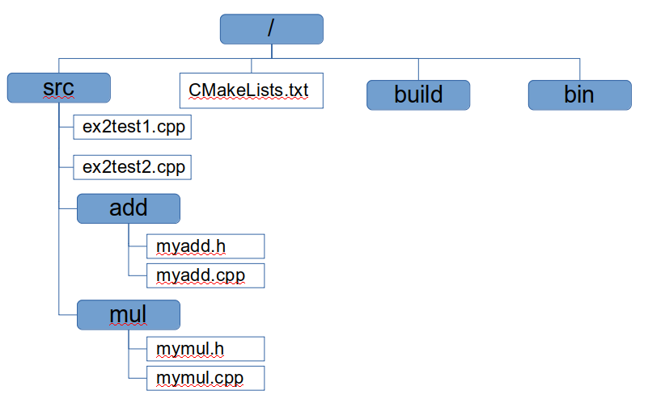

## CMake for building a project with multiple source files
In this episode, we will learn how to build a project that consists of
multiple source files.

In order to effectively manage a complex software project that
consists of multiple source files, it is recommended to organise the project
using multiple directories. The directory structure for a software 
project using CMake is depicted in the following figure.

As shown, the project directory consists of

* a `src` folder which contains all the source files. The `src` folder
  may contain subfolders.

* a `CMakeLists.txt` file with the configuration options.

* a `build` folder for managing the configuration and compilation of the
  source code (for an **out-of-source build**).

* a `bin` directory for installing the executables.

To better understand this, let us build the executable(s) for Example 2.
Copy the ex2 folder from the database into the current working directory and 
change the working directory to `ex2`.

The CMakeLists.txt file contains the following content.
~~~
cmake_minimum_required(VERSION 2.8.1)

project(Math)

include_directories(./src/add  ./src/mul)

file(GLOB sources src/*/*.cpp)

add_executable(ex2test1 ./src/ex2test1.cpp ${sources})
add_executable(ex2test2 ./src/ex2test2.cpp ${sources})

install(TARGETS ex2test1 ex2test2 RUNTIME DESTINATION /home/s.engkadac/cmakecourse/ex2/bin)
~~~
{: .language-bash}

`Make sure that you modify the installation path (DESTINATION) appropriately
before you proceed.`

We now have some additional lines when compared to the file from the
example 1.

* **include_directories** - when we are working with multiple source 
files or external libraries, we have to specify the locations of 
the header files for the compiler to look for. This is done with 
the command **include_directories**.

* **file GLOB** gets the list of files matching the wildcard which can be
passed to the *add_executable* command as the list of dependencies.

Unlike the previous example, we now have two targets (executables) in this example.
We can build all the executables at once using a single execution of
the `make` command, or we can specify the target that we want to build.

**1.) Configuration Step:** This step creates the appropriate
configuration files for the build system. Since we have organised our
project into multiple directories, we use the `build` directory to
store all the files (and folders) related to the configuration of the
project.

Enter the `build` directory (if you are not already in there), and then
execute
~~~
cmake ..
~~~
{: .language-bash}

In `cmake ..`, `..` refers to the parent directory of the present working
directory. Therefore, `cmake` finds the CMakeLists.txt file in the parent
working directory (of the current directory), which is where we placed the 
CMakeLists.txt file.

**2.) Build step:** This step involves compiling the source code,
and generating the executable. This is done by executing
~~~
make
~~~
{: .language-bash}

**3.) Installation step:** This step copies the successfully generated
executables to the path specified. This step is not necessary for this
example. But it is very useful for organising the source code into multiple
folders when dealing with the large projects.
~~~
make install
~~~
{: .language-bash}

> ## make install
> If we execute the second step `make` but forget the third step
> `make install`, then the executables in the DESTINATION folder do not
> get updated.
> Since `make install` also performs the task of step 2, if the source
> code is updated, **it is recommended to use the third step 
> `make install` directly instead of `make` followed by `make install`**.
{: .callout}

> ## Fortran projects
> When working with Fortran source code with Makefiles, we have to 
> supply the (module) dependency information to the Makefiles.
> While this is doable manually for small project, it becomes a
> daunting task for large projects that consists of hundreds of source
> files.
>
> This task is completely avoided by using CMake because CMake 
> resolves depending for us. All that we need to do is to specify the list
> source files, which we can do it by using wildcards, for example, *.f or *.f90 etc.
{: .callout}



